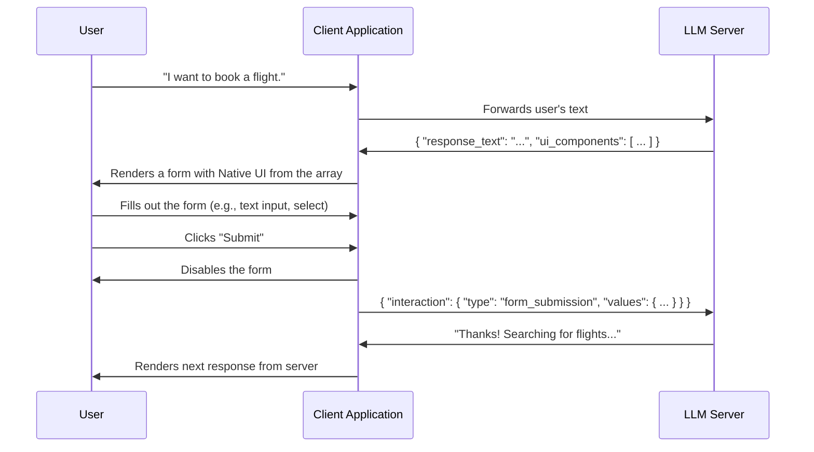
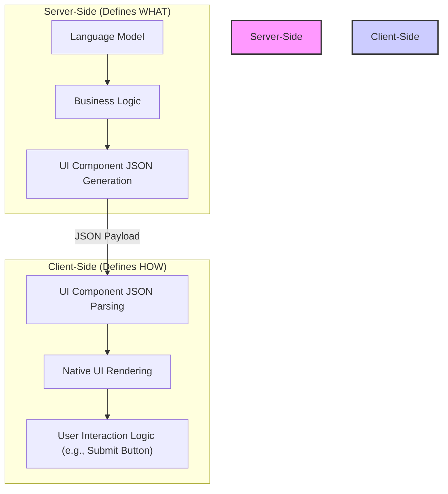

# Interactive Language Model User Interface (LMUI) Protocol

## Abstract

This document proposes the **Language Model User Interface (LMUI) Protocol**, a standardized method for enabling rich, interactive user interfaces within conversational AI experiences. It extends the traditional text-in, text-out paradigm by allowing a Language Model (LLM) to send structured UI descriptions to a client application, which then renders native interactive components. User interactions with these components are sent back to the LLM as structured data, creating a more dynamic, intuitive, and efficient conversational flow.

## The Problem

Modern LLMs are incredibly powerful, but their primary mode of interaction is plain text. This leads to several limitations:

1.  **Ambiguity:** Free-form text input can be ambiguous, requiring multiple conversational turns to clarify user intent.
2.  **Inefficiency:** For tasks like filling out forms or making a selection from a list, typing is far less efficient than using graphical UI elements.
3.  **Limited Experience:** The user experience is confined to that of a command-line interface, which is not ideal for many applications, especially on mobile or graphical platforms.

## The Solution: The LMUI Protocol

The LMUI protocol addresses these issues by defining a simple, extensible contract between the LLM server and the client application. Instead of responding with only text, the LLM can also include a payload describing one or more UI components to be displayed to the user.

### How It Works: The Protocol Flow

The interaction follows a clear, cyclical path, as illustrated below:



### The Client's Role in User Experience

The LMUI protocol is designed to be flexible. The server is responsible for the *data* and the *type* of UI component, but the client is responsible for the final *presentation and interaction*. This creates a clear separation of concerns:



A well-designed client should:
-   Render components that feel native to its platform (e.g., iOS vs. web).
-   Implement user-friendly interaction patterns, like the "Submit" button, to prevent errors and improve clarity.
-   Handle component state, such as disabling a form after submission.

This separation of concerns ensures that the LLM can provide powerful interactive capabilities without being tightly coupled to the client's specific UI/UX implementation.

### Example Protocol Payloads

**Scenario:** A user wants to book a flight.

**1. LLM Server to Client:** The LLM needs multiple pieces of information. It sends a `ui_components` array to generate a form.

```json
{
  "response_text": "I can help with that! Please provide the details for your flight:",
  "ui_components": [
    {
      "type": "text_input",
      "id": "departure_city",
      "label": "Departure City"
    },
    {
      "type": "interactive_select",
      "id": "travel_class",
      "label": "Travel Class",
      "options": [
        { "text": "Economy", "value": "economy" },
        { "text": "Business", "value": "business" },
        { "text": "First Class", "value": "first" }
      ]
    }
  ]
}
```

**2. Client to LLM Server:** After the user fills out the form and clicks "Submit", the client bundles the values into a single object.

```json
{
  "interaction": {
    "type": "form_submission",
    "values": {
      "departure_city": "New York",
      "travel_class": "business"
    }
  }
}
```

**3. LLM Server to Client:** The LLM now has all the information it needs to proceed.

```json
{
  "response_text": "Got it. Searching for business class flights from New York."
}
```

### Benefits of the LMUI Protocol

-   **Richer User Experience:** Moves beyond plain text to create modern, graphical, and app-like experiences.
-   **Reduced Ambiguity:** Selections from lists or forms provide structured, unambiguous data to the LLM.
-   **Increased Efficiency:** Reduces the number of conversational turns required to complete a task.
-   **New Capabilities:** Unlocks new use cases for LLMs, such as configuration wizards, complex form filling, and interactive tutorials.

### Component Extensibility

The protocol is designed to be extensible. While this proof-of-concept uses `interactive_select` and `text_input` components, the schema can easily be expanded to support a wide variety of elements:

-   Buttons
-   Text Inputs
-   Date/Time Pickers
-   Sliders
-   Checkboxes and Radio Buttons
-   File Uploads

By standardizing this communication, we can unlock the next generation of intelligent, interactive applications powered by LLMs.
