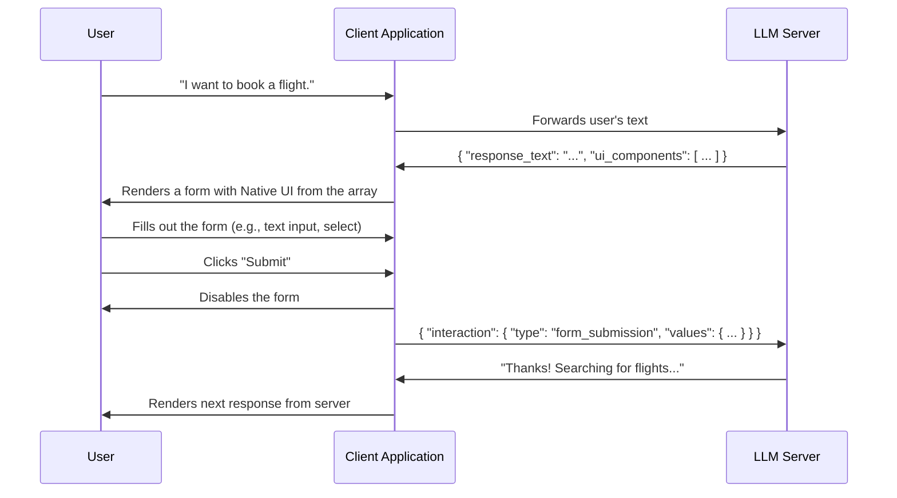
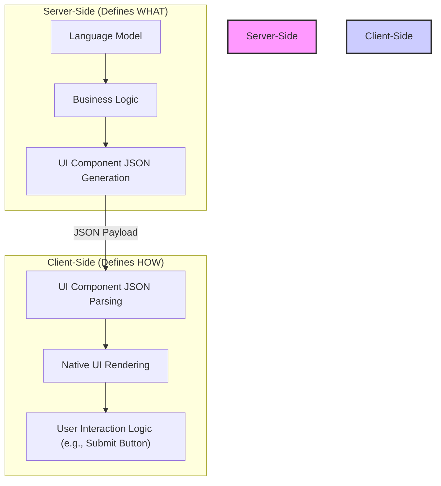

# The Language Model User Interface (LMUI) Protocol

> *This document contains the specification for the **Language Model User Interface (LMUI) Protocol**, a standardized method for enabling rich, interactive user interfaces within conversational AI experiences.*

## The Problem

Modern Language Models (LLMs) are incredibly powerful, but their primary mode of interaction is plain text. This leads to several limitations:

-   **Ambiguity:** Free-form text input can be ambiguous, requiring multiple conversational turns to clarify user intent.
-   **Inefficiency:** For tasks like filling out forms or making a selection from a list, typing is far less efficient than using graphical UI elements.
-   **Limited Experience:** The user experience is confined to that of a command-line interface, which is not ideal for many applications.

## The Solution

The LMUI protocol addresses these issues by defining a simple, extensible contract that empowers the LLM to request information using UI components directly within the chat interface. Instead of only responding with text, the LLM can also send a structured payload describing one or more UI components to be rendered by the client.

This enables richer, more efficient, and more intuitive conversational flows.

---

## Technical Specification

### 1. Protocol Flow

The interaction follows a clear, cyclical path, as illustrated below. This flow allows for a request-response cycle where the response can be an interactive form.



---

### 2. Architecture: Separation of Concerns

The LMUI protocol is designed to be flexible. The server is responsible for the **what** (*data* and the *type* of UI component), but the client is responsible for the **how** (the final *presentation and interaction*). This creates a clear separation of concerns.



A well-designed client **should**:

-   Render components that feel native to its platform (e.g., iOS vs. web).
-   Implement user-friendly interaction patterns, like the "Submit" button, to prevent errors and improve clarity.
-   Handle component state, such as disabling a form after submission.

This architecture ensures that the LLM can provide powerful interactive capabilities without being tightly coupled to the client's specific UI/UX implementation.

---

### 3. Payloads and Components

> **&#8594; For a detailed breakdown of all supported component types, see the [Component Specification Document](COMPONENTS.md).**

#### 3.1. Server-to-Client Payload

The server sends a JSON object that can contain both a text response and an array of `UIComponent` objects.

-   `response_text` (string): The text to display to the user.
-   `ui_components` (array): An array of `UIComponent` objects.

**Example `UIComponent` objects:**

```json
[
    {
        "type": "text_input",
        "id": "departure_city",
        "label": "Departure City"
    },
    {
        "type": "interactive_select",
        "id": "travel_class",
        "label": "Travel Class",
        "options": [
            { "text": "Economy", "value": "economy" },
            { "text": "Business", "value": "business" },
            { "text": "First Class", "value": "first" }
        ]
    }
]
```

#### 3.2. Client-to-Server Payload

After the user interacts with the form and submits, the client sends a JSON object containing the results.

-   `interaction`: An object containing:
    -   `type` (string): Should be `form_submission`.
    -   `values` (object): A key-value map where keys are the `id` of each component. The format of each value depends on the component's type (see the [Component Specification](COMPONENTS.md) for details).

**Example:**

```json
{
	"interaction": {
		"type": "form_submission",
		"values": {
			"departure_city": "New York",
			"travel_class": "business"
		}
	}
}
```

#### 3.3. Component Extensibility

The protocol is designed to be extensible. While this specification currently defines components for text input, selection, sliders, and more, the schema can easily be expanded to support a wider variety of elements. Future versions could include:

-   **Date & Time Pickers:** For selecting specific dates, times, or ranges.
-   **File Uploads:** To allow users to send files.
-   **Standalone Buttons:** To trigger specific actions outside of a form submission.
-   **Static Image:** To display a static image.

---

### 4. Benefits

-   **Richer User Experience:** Moves beyond plain text to create modern, graphical, and app-like experiences.
-   **Reduced Ambiguity:** Selections from lists or forms provide structured, unambiguous data to the LLM.
-   **Increased Efficiency:** Reduces the number of conversational turns required to complete a task.
-   **New Capabilities:** Unlocks new use cases for LLMs, such as configuration wizards, complex form filling, and interactive tutorials.

---
---

## Reference Implementation

This repository contains a reference implementation of the LMUI protocol, built with **Next.js** and ready to be deployed to **Vercel**.

### Features

-   A clean, modern chat interface.
-   A mock "LLM" that responds with interactive forms when specific keywords (e.g., "book a flight") are used, following the protocol specification.
-   Dynamic rendering of forms containing multiple component types (`text_input`, `interactive_select`).
-   Submission of structured data back to the mock LLM.

### Running the Demo

The reference implementation is located in the `/demo` directory. To run it locally:

1.  **Navigate to the demo directory:**
    ```bash
    cd demo
    ```

2.  **Install dependencies:**
    ```bash
    npm install
    ```

3.  **Run the development server:**
    ```bash
    npm run dev
    ```

4.  Open [http://localhost:3000](http://localhost:3000) in your browser to see the application.
